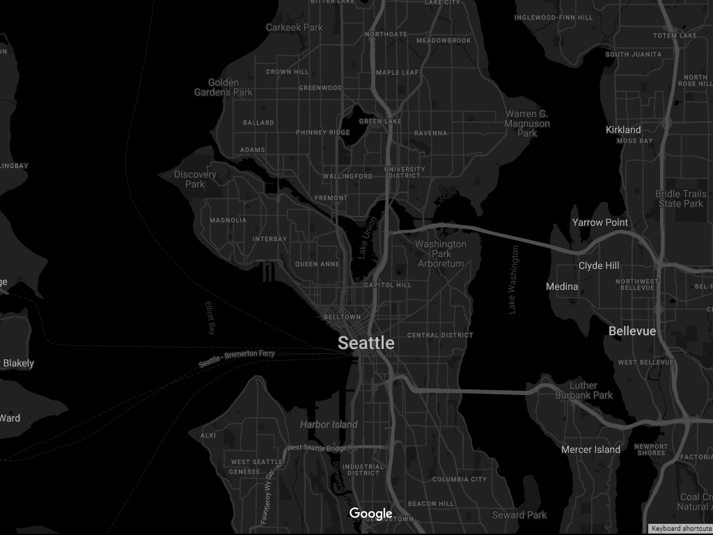

# Custom G-Maps WordPress Plugin



## Overview

**Custom G-Maps** is a feature-rich WordPress plugin designed to simplify the integration of personalized Google Maps into your website. Whether you prefer using shortcodes or Elementor widgets, this plugin offers a seamless solution with customizable themes.

## Features

- **Easy Integration:** Embed Google Maps effortlessly with shortcodes or Elementor widgets.
- **Customizable Themes:** Tailor the appearance of your maps to match your website's design.
- **Enhanced User Experience:** Create visually appealing and engaging maps for improved navigation.

## Installation

1. Download the plugin zip file.
2. Upload and activate it through the WordPress admin.
3. Configure settings in the WordPress dashboard under "Custom G-Maps."

## Usage

### Shortcode

Use the `[cgmaps_shortcode]` shortcode in your posts or pages.

```shortcode
[cgmaps_shortcode mapid=0]
```

### Elementor Widget

Drag the "Custom G-Maps" widget to your Elementor page and configure the settings.

## Support

For issues or feature requests, please [open an issue](https://github.com/davidesidoti/custom-gmaps/issues).

## Contributing

Contributions are welcome! Please check the [contribution guidelines](CONTRIBUTING.md).

## License

This project is licensed under the GNU General Public License v3.0. See [LICENSE](LICENSE) for more details.

---

**Custom G-Maps** is crafted with ❤️ by Davide Sidoti.
